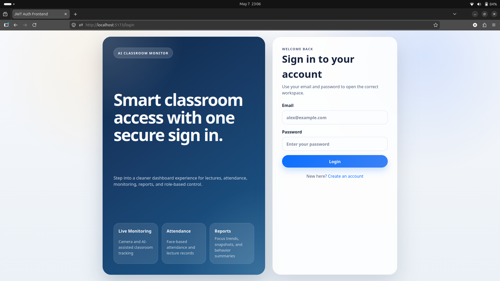
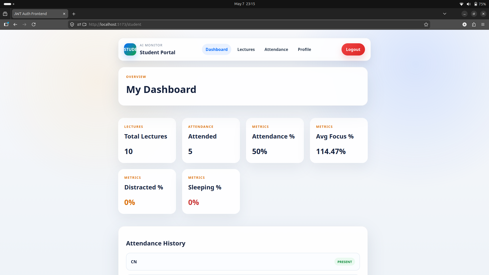
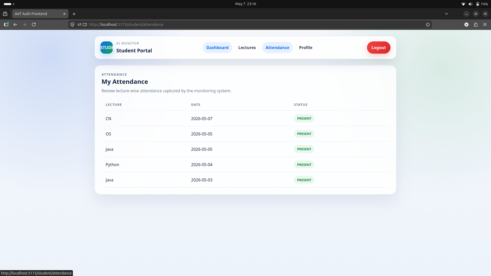
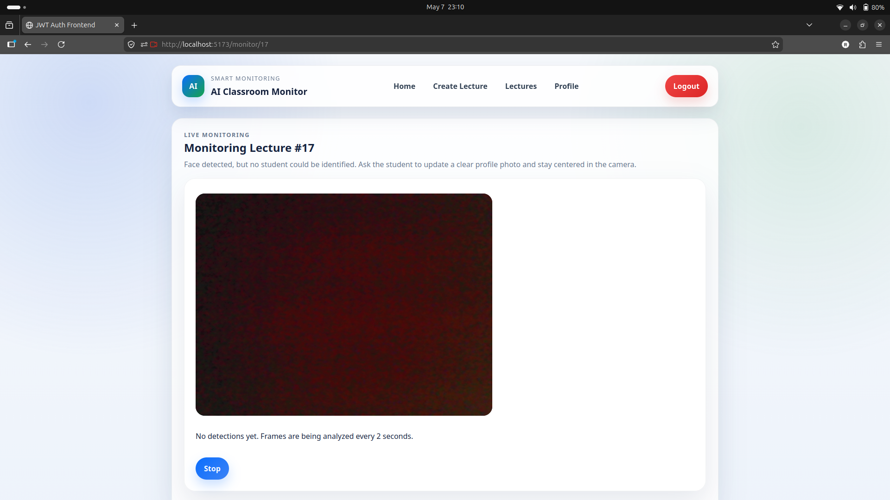
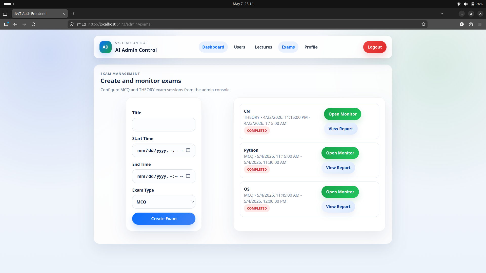
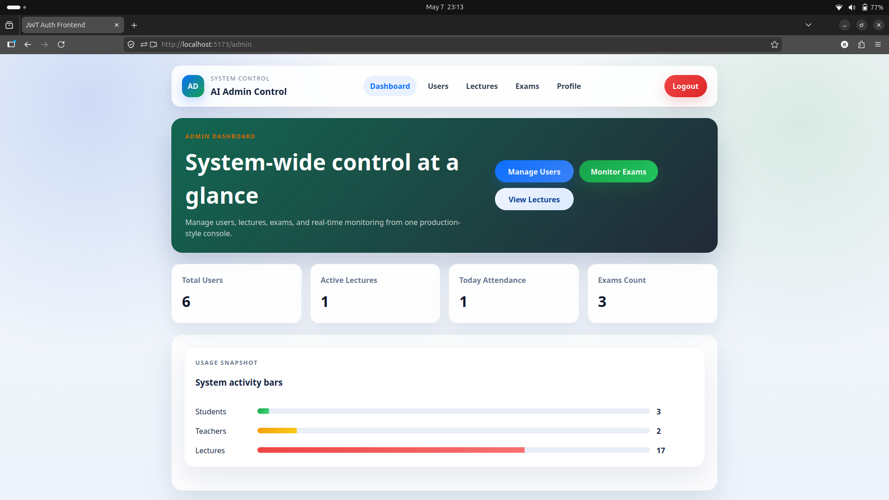
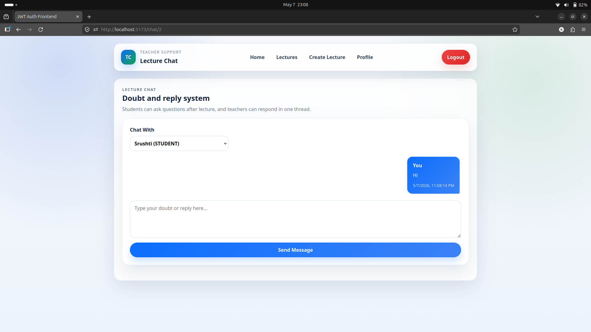

# AI Powered Smart Classroom Management System

A full-stack classroom management platform built using Spring Boot and React.

This system provides secure JWT authentication, role-based access control, attendance management, lecture management, classroom monitoring, and separate dashboards for students, teachers, and administrators.

---

## Features

- JWT Authentication & Authorization
- Role-Based Access Control
- Student Dashboard
- Teacher Dashboard
- Admin Dashboard
- Attendance Management
- Lecture Management
- Classroom Monitoring System
- Chat System
- Profile Management
- Protected Routes
- REST APIs
- Global Exception Handling

---

## Tech Stack

### Backend
- Java
- Spring Boot
- Spring Security
- JWT Authentication
- JPA/Hibernate
- MySQL

### Frontend
- React.js
- Vite
- Axios
- React Router
- Context API

---

## Project Structure

```text
backend/
frontend/
Screenshots/
```

---

## Screenshots

### Login Page


### Student Dashboard


### Attendance System


### Monitoring System


### Exam Monitoring


### Admin Dashboard


### Chat System


---

## Installation

### Backend Setup

```bash
cd backend
mvn spring-boot:run
```

### Frontend Setup

```bash
cd frontend
npm install
npm run dev
```

---

## Future Improvements

- AI-based attentiveness tracking
- Real-time notifications
- Face recognition attendance
- Analytics dashboard
- Cloud deployment

---

## Author

Ravi Mule
